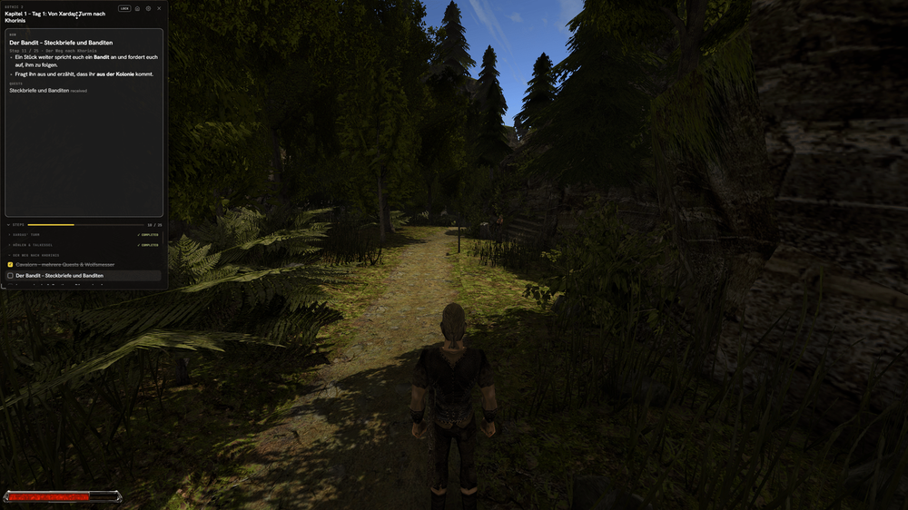

# GoThrough


**Follow any game's walkthrough in an always-on-top overlay — no more alt-tabbing.**

GoThrough is a game-agnostic walkthrough overlay. Load a YAML guide for any game
and step through it in a movable HUD that stays on top of the game, with global
hotkeys and progress that resumes where you left off.

<!-- TODO: replace with a real screenshot/GIF of the overlay over a game.
     Drop the image at docs/overlay.png and it will render here. -->


> Community-driven and open source — for any game.

## Features

- **Always-on-top overlay** that sits over the game like a HUD
- **Global hotkeys** that work while the game has focus — next/prev/hide/quit
- **Picker on launch** — double-click, pick a game and chapter, go
- **Resumes automatically** — your progress and last walkthrough are remembered
- **Quest checklist** with sections, per-step tasks, hints, warnings and quests
- **Movable & adjustable** — drag it anywhere, dial the opacity to a glassy HUD
- **Themes** — dark, light, and high-contrast
- **Manual progression** — no fragile auto-detection to lead you astray

## Install

Download the latest build for your OS from the
[**Releases**](https://github.com/XotoX1337/GoThrough/releases) page:

- **Windows** — `GoThrough.exe` (WebView2 is pre-installed on Windows 10/11)
- **Linux** — the Linux binary from the same release

No installer — just run the binary. Prefer building it yourself? See
[Building from source](#building-from-source).

## Quick start

1. Run **windowed** or **borderless windowed** in your game's display settings
   (true exclusive fullscreen can hide the overlay).
2. Launch GoThrough and pick a game → chapter, **or** open your own file:
   ```bash
   GoThrough.exe run path/to/walkthrough.yaml
   ```
3. Step through with the buttons or the hotkeys below. Progress saves itself.

### Hotkeys

Global hotkeys work even while the game has focus, and are **rebindable** from
the in-HUD settings panel (click the gear). Defaults:

| Hotkey | Action |
|---|---|
| `Ctrl+Alt+→` | Next step |
| `Ctrl+Alt+←` | Previous step |
| `Ctrl+Alt+H` | Toggle overlay visibility |
| `Ctrl+Alt+M` | Focus overlay |
| `Ctrl+Alt+Q` | Quit |

> Mouse buttons can be bound too (e.g. `Ctrl+Alt+MiddleClick`, side buttons). A
> bare click still passes straight through to the game. Mouse-button hotkeys are
> unsupported under Wayland and on macOS.

### Resetting saved state

Progress and settings live under your OS user-config dir
(`%AppData%\GoThrough\` on Windows, `~/.config/GoThrough/` on Linux). Reset them
without launching the overlay:

```bash
GoThrough.exe clear progress "Gothic 2"      # reset a whole game's progress
GoThrough.exe clear progress "Gothic 2" 1    # reset one chapter
GoThrough.exe clear settings                 # restore default settings
GoThrough.exe clear cache                    # delete the downloaded config cache
GoThrough.exe clear all                      # progress + settings + cache
```

The same actions are in the overlay: a reset button on each picker row, **Clear
cache** in the picker, and **Reset to defaults** in the settings panel.

## Write a walkthrough

A walkthrough is a YAML file. The minimal form is a flat list of steps:

```yaml
game: Gothic 2
version: vanilla
author: yourname
chapter: 1
title: "Chapter 1 - Arrival in Khorinis"

steps:
  - id: 1
    title: "Leave Xardas' Tower"
    description: "Go down the stairs and exit the tower."

  - id: 2
    title: "Head to Khorinis"
    description: "Follow the southern path to the city gate."
```

Larger guides can group steps into **sections**, branch on **choices**, attach
**tasks/hints/warnings/quests** to a step, and chain across files with **`next`**.
See the **[full config format reference](docs/config-format.md)**.

---

## Contributing

### Community configs

Bundled walkthroughs live under `configstore/configs/`, meant to grow into a
community-maintained library. Wrote one? Open a PR — see the
[config format reference](docs/config-format.md).

### Generating configs with AI

Most games already have detailed text walkthroughs (forum threads, wikis, guide
sites). An LLM (Claude, ChatGPT, …) can turn that source prose into a GoThrough
YAML config — you curate and verify, the model does the formatting grunt work.

1. **Gather the source.** Copy the walkthrough text for **one** chapter. One
   chapter → one YAML file, chained to the next with `next:`. Feeding a whole
   game at once produces worse results — the model loses consistency and drifts.
2. **Give the model the schema.** Paste the
   [config format reference](docs/config-format.md) (or link it) so the output
   matches the current schema (v3).
3. **Prompt** — something like:

   > You convert game walkthroughs into GoThrough YAML configs. Follow the schema
   > in the reference I gave you exactly. Turn the walkthrough below into one YAML
   > file. Rules:
   > - Group steps into `sections` by area/objective. One step = one meaningful
   >   location or goal — not one sentence, and not a whole region.
   > - Short imperative `title`; break the prose into `tasks`.
   > - Put loot/gold/EXP/stat values in `info` or `hint`, dangers in `warning` —
   >   per-task when it belongs to one task, else step-level.
   > - Record quest pickups/turn-ins under `quests` (`status: received|completed`).
   > - Mark detours `optional: true`. Model "do X or Y" forks as a `choice` with
   >   `when` guards.
   > - Quote any task string containing a colon-space (`": "`) — unquoted it
   >   parses as a YAML mapping and breaks the file.
   > - Copy numbers (EXP, gold, damage) verbatim from the source; never invent or
   >   round them. If the source is unclear, leave it out.
   > - Keep the walkthrough's original language. Set `source:` to the attribution
   >   I give you. Output only valid YAML, nothing else.
   >
   > Walkthrough: <paste here>

4. **Review every step against the source.** This is the real work — the model is
   a formatter, not an authority. From doing this by hand, the recurring failure
   modes are:
   - **Invented or rounded numbers.** EXP/gold/damage values are where models
     hallucinate most. Check each against the source.
   - **Dropped branches.** Class/guild/route forks get flattened into one path —
     make sure every "or" became a `choice`/`when`, not a silent choice.
   - **Wrong granularity.** Either one giant step per region or a step per
     sentence. Aim for one objective per step.
   - **YAML breakage.** Unquoted `": "` in tasks, and stray prose outside the
     YAML. Run `GoThrough.exe run file.yaml` once — it won't load if the YAML is
     malformed, and you can eyeball that it renders.

   Always fill in `source:` to credit the original author.

### Building from source

Requirements:

- Go 1.21+
- [Wails v2 CLI](https://wails.io/docs/gettingstarted/installation):
  `go install github.com/wailsapp/wails/v2/cmd/wails@latest`
- A C compiler (Windows: [MinGW via Scoop](https://scoop.sh) — `scoop install mingw`)
- WebView2 Runtime (pre-installed on Windows 10/11)

```bash
wails build -s                                       # build → build/bin/GoThrough.exe
./build/bin/GoThrough.exe                            # open the config picker
./build/bin/GoThrough.exe run path/to/file.yaml      # run a walkthrough directly
make run                                             # shortcut: build + open the picker
```

`-s` skips the npm frontend pipeline — assets are embedded directly via `//go:embed`.

### Tech stack

| Component | Technology |
|---|---|
| Language | Go 1.21+ |
| CLI | [Cobra](https://github.com/spf13/cobra) |
| Overlay UI | [Wails v2](https://wails.io) |
| Config format | YAML |
| Global hotkeys | [`golang.design/x/hotkey`](https://github.com/golang-design/hotkey) |

## License

[MIT](LICENSE)
